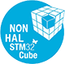

# Non HAL Library
This is the library for STM32 with functions absent in the HAL library. This library contains function that can be useful for working with external periphery or for internal purposes. The functions in this library may be located elsewhere on the internet, but in this library they're in same place. I often use this functions and think it will come in handy for other users HAL library and STM microcontrollers.

## What the library contains

At this moment, the library contains the follow main modules:

+ non_hal_conv.c - functions for converting numeric types to character strings and vice versa;
+ non_hal_kalmfilter.c - functions to filter data with the fast Kalman filter.

## How to use

If you are using the STM32f4xx family:

Make sure that you include the HAL library (use the CubeMX to do it). After that, you can simply include the **non_hal_lib.h** file in your main project file (e.g. main.c or main.h).

Otherwise:

In additional, you must rename the include in **non_hal_lib.h** (`#include "stm32f4xx_hal.h"`).

## Documentation

The Doxyfile file is the project file for [**Doxygen**](https://www.doxygen.nl/index.html). If you need the html documentation on this library you can generate it. You can use Doxywizard or use console command:

```bash
doxygen ./Doxyfile
```

And the documentation will be generated in the ./doc directory.

## Issues

If the library doesn't work or if you know about potential errors (and mistakes, typos, ets.), please let me know (vlavit97@gmail.com or https://t.me/darkyfoxy).

If you know how to improve performance or want to add new functions, I look forward to your pull requests.

